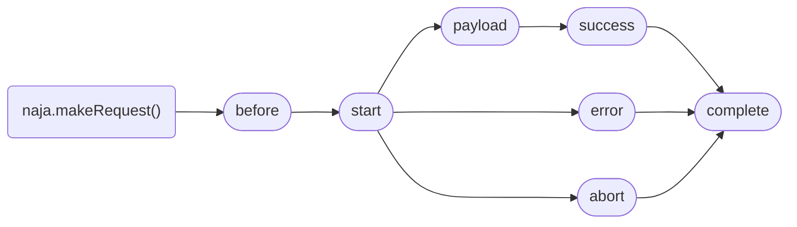

# Events reference

Naja and some of its components implement the `EventTarget` interface. This means that you can hook onto the lifecycle events via the `addEventListener()` method. All dispatched events are `CustomEvent`s and their `detail` attribute holds event-specific data.


## Naja

### init

This event is dispatched [when `naja.initialize()` is called](initialization.md). It can be used to initialize all the necessities of an extension.

The `init` event's `detail` has the following properties:

- `defaultOptions: Object`, an object holding the default options passed to `naja.initialize()` method.

```js
naja.addEventListener('init', (event) => {
	console.log(event.detail.defaultOptions);
});
```

Depending on how you initialize Naja, the DOM might not yet be loaded by the time this event is dispatched. You should make sure that the DOM is loaded if you access it in the `init` listener:

```js
naja.addEventListener('init', (event) => {
	const attachListener = () => document.querySelector('.selector').addEventListener('keydown', (event) => { /* ... */ });
	if (document.readyState === 'loading') {
		document.addEventListener('DOMContentLoaded', () => attachListener());
	} else {
		attachListener();
	}
});
```


## Request lifecycle

Whenever a request is dispatched, either directly via `naja.makeRequest()` or indirectly through user interaction, Naja dispatches a set of events throughout the request's lifecycle:




### before

This event is dispatched when the `Request` is created but not yet sent. At this point, you can call the event's `preventDefault()` method to cancel the request.

The event's `detail` holds the following properties:

- `request: Request`, the Fetch API request object,
- `method: string`, the requested HTTP method,
- `url: string`, the requested URL,
- `data: any`, the data to be sent along with the request,
- `options: Object`.

```js
naja.addEventListener('before', (event) => {
	if (event.detail.url.endsWith('/forbidden')) {
		event.preventDefault();
	}
});
```

### start

This event is dispatched right after the request is sent. Its `detail` holds the following properties:

- `request: Request`, the Fetch API request object,
- `promise: Promise`, the original Promise returned by `fetch()`,
- `abortController: AbortController`, an `AbortController` instance for current request,
- `options: Object`.

```js
const abortControllers = new WeakMap();
naja.addEventListener('start', (event) => {
	abortControllers.put(event.detail.request, event.detail.abortController);
});
```

### abort

This event is dispatched if the request is aborted. Aborting the request does not trigger error handling because it is not an error per se, but it might be useful to react to it. This event's `detail` has the following properties:

- `request: Request`, the aborted request object,
- `error: AbortError`, the abort error instance,
- `options: Object`.

```js
naja.addEventListener('abort', (event) => {
	if (window.confirm('The request was aborted. Retry?')) {
		naja.makeRequest(
			event.detail.request.method,
			event.detail.request.url,
			null,
			event.detail.options,
		);
	}
});
```

### payload & success

This pair of events is dispatched when the request successfully finishes. The `detail` of both of these events has the following properties:

- `request: Request`, the request object,
- `response: Response`, the returned response object,
- `payload: Object`, the parsed response payload,
- `options: Object`.

```js
naja.addEventListener('success', (event) => {
	const url = event.detail.payload.url ?? event.detail.request.url;
	third.party.analytics.push('pageView', url);
});
```

The difference between `payload` and `success` is that any userland listeners attached to the `success` event run *after* Naja's internal components, while listeners to the `payload` event are triggered *before* Naja's internals. You can use the `payload` event to set `options` for Naja's internals based on the payload received from the server.

?> The `payload` event has been introduced in Naja 2.5.0.

### error

This event is dispatched when the request finishes with errors. Its `detail` has the following properties:

- `request: Request`, the request object,
- `response: ?Response`, the response object if there is any,
- `error: Error`, an object describing the error,
- `options: Object`.

```js
naja.addEventListener('error', (event) => {
	third.party.errorTracker.sendError(event.detail.error);
});
```

### complete

This event is dispatched when the request finishes, regardless of whether it succeeded or failed. Its `detail` has the following properties:

- `request: Request`, the request object,
- `response: ?Response`, the response object if there is any,
- `payload: ?Object`, the parsed response payload if the request succeeded,
- `error: ?Error`, an object describing the error if the request failed,
- `options: Object`.

```js
naja.addEventListener('complete', (event) => {
	console.debug(`Finished processing request ${event.detail.request.url}`);
});
```


## UIHandler

### interaction

This event is dispatched when the user interacts with a DOM element that has the Naja's listener bound to it, or when using manual dispatch. This event's `preventDefault()` method can be used to prevent the request from being dispatched.

This event's `detail` has the following properties:

- `element: HTMLElement`, the element the user interacted with,
- `originalEvent: ?Event`, the original UI event, or `undefined` if the interaction was triggered [by hand](ui-binding.md#manual-dispatch),
- `options: Object`, an empty object that can be populated with options based on the element's attributes.

See the [UI binding docs](ui-binding.md#interaction-event) for usage examples.


## SnippetHandler

### beforeUpdate

This event is dispatched *before* updating the contents of each and every snippet. You can prevent the snippet from updating by calling the event's `preventDefault()` method.

The event's `detail` has the following properties:

- `snippet: Element`, the snippet element,
- `content: string`, the new content from response payload,
- `fromCache: boolean`, a flag telling whether the snippet is being updated from cache after user navigation through history, or as a result of a request to the server,
- `operation: SnippetUpdateOperation`, the operation that is going to be done with the snippet and its new content,
- `changeOperation: (operation: SnippetUpdateOperation) => | void`, a method that can be called to override the snippet update `operation`,
- `options: Object`.

### pendingUpdate

This event is dispatched right before the now asynchronous update is invoked, and only if the update has not been prevented in `beforeUpdate` event. This event allows you to react to a snippet update synchronously, as opposed to `afterUpdate` that is only dispatched after the update operation resolves.

The event's `detail` has the following properties:

- `snippet: Element`, the snippet element,
- `content: string`, the new content from response payload,
- `fromCache: boolean`, a flag telling whether the snippet is being updated from cache after user navigation through history, or as a result of a request to the server,
- `operation: SnippetUpdateOperation`, the operation that will be done with the snippet and its new content,
- `options: Object`.

?> The `pendingUpdate` event has been added in Naja 3.0.0.

### afterUpdate

This event is dispatched *after* updating the contents of each and every snippet. If the snippet update has been prevented by canceling the `beforeUpdate` event, this event is not dispatched for given snippet.

The event's `detail` has the following properties:

- `snippet: Element`, the snippet element,
- `content: string`, the new content from response payload,
- `fromCache: boolean`, a flag telling whether the snippet is being updated from cache after user navigation through history, or as a result of a request to the server,
- `operation: SnippetUpdateOperation`, the operation that has been done with the snippet and its new content, 
- `options: Object`.

See the [snippet handling docs](snippets.md#snippet-update-events) for usage examples.


## RedirectHandler

### redirect

This event is dispatched before a redirect is made. The event's `preventDefault()` method can be used to prevent the redirection from happening. You can also see and alter whether the redirect is going to be made by issuing another asynchronous request through Naja, or the hard way via the browser.

The `redirect` event's `detail` has the following properties:

- `url: string`, the target URL,
- `setUrl: (url: string) => void`, a method which can be called to alter the target URL,
- `isHardRedirect: boolean`, a flag telling whether the redirect is going to be a hard one,
- `setHardRedirect: (value: boolean) => void`, a method which can be called to override the hard redirect flag,
- `options: Object`.

?> The `setUrl()` method has been added in Naja 2.6.0.

See the [redirection docs](redirection.md#redirect-event) for usage examples.


## HistoryHandler

### buildState

This event is dispatched when a history entry state is being constructed. You can use this event to alter the history entry state, e.g. attach additional information to it.

The `buildState` event's `detail` has the following properties:

- `state: Object`, the built state to be stored in the history entry,
- `operation: 'pushState' | 'replaceState'`, a value indicating whether the current state is being replaced, or a new state is being pushed,
- `isInitial: boolean`, a flag that distinguishes the initial state being built after a full page load,
- `options: Object`, the options of the request that caused the history entry to be added.

!> The `state` contains metadata that Naja relies on during restoration. Please do not override these keys: `source`, `cursor`, `href`.

?> The `operation` property has been added in Naja 2.6.0.

?> The `isInitial` property has been added in Naja 3.3.0.

### restoreState

This event is dispatched when a history state entry is being restored in response to user navigation.

The `restoreState` event's `detail` has the following properties:

- `state: Object`, the state that is being restored from the history entry,
- `direction: number`, a number indicating the direction of the navigation: negative for going back in history, positive for going forward,
- `options: Object`, the options object constructed from Naja's `defaultOptions`.

?> The `direction` property has been added in Naja 2.6.0.

See the [history integration docs](history.md#history-integration-events) for usage examples.


## SnippetCache

### store

This event is dispatched when snippets are being stored in cache. You can alter the snippets to be stored in cache. You can also call the event's `preventDefault()` method to entirely bypass Naja's behaviour and keep this request off-the-record as far as snippet cache is concerned.

The `store` event's `detail` has the following properties:

- `snippets: Object`, the snippets to be stored in cache storage,
- `state: Object`, the built state to be stored in the history entry,
- `options: Object`, the options of the request that caused the history entry to be added.

### fetch

This event is dispatched when snippets are being fetched from cache in response to user navigation. You can use this event to alter the snippet caching behaviour or provide options for the subsequent asynchronous request if cache is disabled. You can also call the event's `preventDefault()` method to entirely bypass Naja's behaviour and handle the snippets restoration on your own.

- `state: Object`, the state that is being restored from the history entry,
- `options: Object`, the options of the request that will be fired if snippet cache is disabled.

### restore

This event is dispatched when snippets are being restored from cache. You can use this event to alter the snippets to be restored. You can also call the event's `preventDefault()` method to entirely bypass Naja's behaviour and handle the snippets restoration on your own.

The `restore` event's `detail` has the following properties:

- `snippets: Object`, the snippets to be updated, as restored from cache storage,
- `state: Object`, the state that is being restored from the history entry,
- `options: Object`, the options used for snippet update; you can read these in [SnippetHandler's events](#snippethandler).

See the [snippet cache docs](snippet-cache.md#snippet-cache-events) for usage examples.
